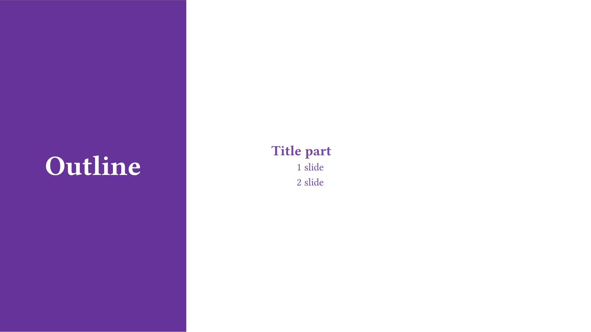
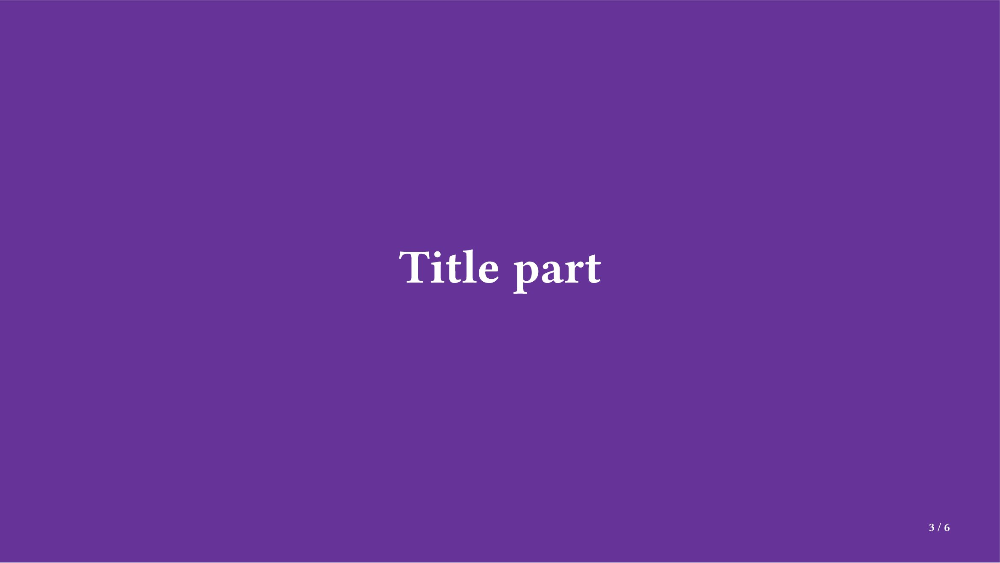
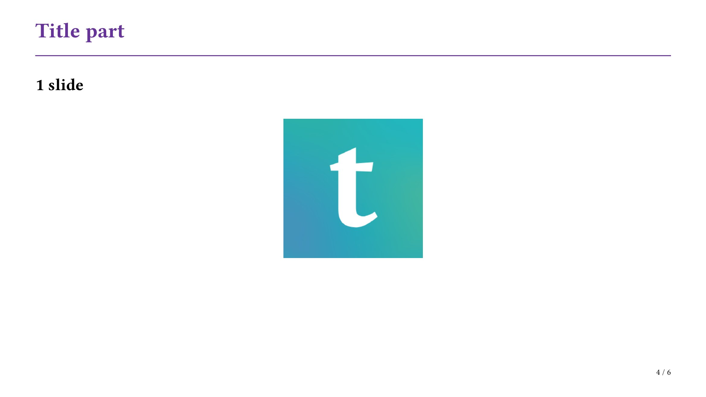

# Typst template

## Beamer
### Use template
```typ
#import "beamer.typ" : beamer

#show: beamer.with(
  title: "Title page",
  author: "author",
  date: [#datetime.today().display(" [Month repr:numerical], [day] [year]")],
  end: "End Slide",
)
```

### Render
<details>
<summary>Outline</summary>

</details>
<details>
<summary>Section</summary>

</details>
<details>
<summary>Slide</summary>

</details>


